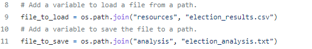

# Election Analysis

## Project Overview
A Colorado Board of Elections employee has given me the following tasks to complete the election audit of a recent local congressional election.

1. Calculate the total number of votes cast.
2. Get a complete list of candidates who received votes.
3. Calculate the total number of votes each candidate received.
4. Calculate the percentage of votes each candidate won.
5. Determine the winner of the election based on popular vote.

## Resources
- Data Source: election_results.csv
- Software Python 3.6.1, Visual Studio Code, 1.38.1

## Summary
The analysis of the election show that:
- There were 369,711 votes cast in the election.
- The candidates were:
  - Charles Casper Stockham
  - Diana DeGette
  - Raymon Anthony Doane
- The candidate results were:
  - Charles Casper Stockham received 23.0% of the vote and 85,213 number of votes.
  - Diana DeGette received 73.8% of the vote and 272,892 number of votes.
  - Raymon Anthony Doane received 3.1% of the vote and 11,606 number of votes.
- The winner of the election was:
  - Diana DeGette who received 73.8% of the vote and 272,892 number of votes.
 
## Challenge Overview of Election Audit
After reporting the above result, the Colorado E=election committee requested more information: 
 
1. Calculate the voter turnout for each county.
2. Calculate the percentage of votes from each county out of the total vote count.
3. Determine the county with the highest voter turnout. 
 
## Challenge Audit Results
The analysis if the election data shows that:
- The voter turnout by county was:
  - Jefferson County with 10.5% of the total vote count and 38,855 votes.
  - Denver County with 82.8% of the total vote count and 306,055 votes.
  - Arapahoe County was 6.7% of the total vote count and 24,801 votes.
- The county with highest turnout was:
  - Denver County
## Challenge Audit Summary
With minor changes, the script used to analyze this election can be used for any election if the data in the csv is formatted the same. The two modifications would happen in lines 9 and 11 in image 1. Row 9 shows the path of where the election data csv is stored. Assuming the data is stored in the same "resources" folder, if new election data, "special_election_data.csv", used this script then line 9 and would be updated to
`file_to_load = os.path.join("resources", "special_election_results.csv")`.

 
**Image 1**

The second change would happen in line 11 where the Text file to hold the results is located. Assuming the path is the same and the text file's location is in "analysis", modify "election_analysis.txt" to the name of the new text file. 
If the location of the files change also then the location of the files in each line must change. "resources" and "analysis" in the script must change to reflect the locations of the csv and text files respctively. 
